# Automatic Cat Feeder
**Author:** Jennifer von Trotta-Treyden (jv222th)

## Project overview
This project will create a prototype for an automatic cat feeder that dispenses food when the bowl is getting low (My cat is free fed meaning she always has kibble out). It would be simple to change it to instead dispense during certain times and fill the bowl to a certain weight instead of trying to keep the bowl consistently full aswell. The project uses an IoT device with both sensors and acutators, using the built in WiFi capabilities of the Raspberry Pi Pico W to send notifications through the Telegram API if there is an error in dispensing the food or if the container is running low, it also sends data to an AdaFruti IO server feed for data visualization. The build of the frame/casing consists of plexiglass, cut and built by hand, the innerbox and construction is made using a plastic container that has been altered to work for the project.

Estimated time to make the project could be anywhere between **6-24+** hours, a lot depends on how you choose to build the boxes/construction, the thing that took me the longest was to cut the plexiglass into pieces because of lack of proper tools for it and build the box and the second longest was debugging the HX711 and load cell setup.

**Code Language:** MicroPython

## Objective
I chose this project because I have an indoor cat and she is free fed (meaning she always has dry food out). I was contemplating different projects I could use surrounding my cat and knew I wanted to do something for her that would also make something easier for me, an auto feeder ended up being the most fitting project for that, that also both include sensors and acutators. It will make it easier to make sure that there is always food in the bowl both when you are away during the day but also if the food runs out in the middle of the night. It will also send notifications to my cellphone when the food is running low in the dispenser container so that I don't always have to check all the time if it needs refilling, the container has the capacity for approximately 4-5 full bowls which means I will not have to refill for around 4-5 days since my cat eats around a bowl a day.

I wanted to include both sensors and acutators to this project, since I was pretty new to IoT and the hardware aspect in general I wanted to challenge myself a bit on that front and learn more about it. I have a bit of knowledge about programming (mostly javascript/java though) so the hurdle there was just to get used to a new language (MicroPython).

## Material
Since I was pretty new with hardware I took a safe route and built everything on a breadboard, it made it easier to experiment and move the cables around but will in the end not be as securely attached as if it was soldered together instead. All of my material is bought from electrokit or my local store, but I will link the specific component in the table below.
There is one (1) of each component except the cables.

|  Component  | Description | Price (SEK) | Source/Artnr |
| --------  | ------- | ------- | ------- |
| Breadboard | The connecting board for all the components | **69** | [10160840](https://www.electrokit.com/kopplingsdack-840-anslutningar) |
| Raspberry Pi Pico WH | The microcontroller that runs the code and controls all the sensors and acutators, also sends data via a built in wifi capabilities | **109** | [41019114](https://www.electrokit.com/raspberry-pi-pico-wh) |
| USB to Micro USB cable | Powers the Raspberry pi pico and subsequent sensors/acutators | **39** | [41003290](https://www.electrokit.com/usb-kabel-a-hane-micro-b-5p-hane-1.8m) |
| Micro servo TS90 / SG90 360° 1.2kg | Controls the open and shut plate to dispense food | **64** | [41013137](https://www.electrokit.com/micro-servo-ts90-sg90-1.2kg-360) |
| HX711 amplifier | Acts as a middle point for the loadcell, converts the analog signals to digital and amplify it | **155** | [41013925](https://www.electrokit.com/forstarkare-for-lastceller-hx711) |
| Wheatstone load cell 1kg | The sensor that gauges weight, sends analog signals to the HX711 amplifier | **99** | [41016242](https://www.electrokit.com/lastcell-1kg) |
| Photoresistor | Sensor that measures the light, the brighter the light source the lower the resistance is and can hence tell the difference between light and dark | **9** | [40850001](https://www.electrokit.com/fotomotstand-cds-4-7-kohm) |
| 5mm LED lamp | Used to see if the inner containers need to be refilled | **5** | [40307020](https://www.electrokit.com/led-5mm-rod-diffus-1500mcd) |
| 330ohm 0.25W resistor | Lowers the resistance to the LED | **1** | [40810233](https://www.electrokit.com/motstand-kolfilm-0.25w-330ohm-330r) |
| Cables | Connect all the components | **55** | [41012684](https://www.electrokit.com/labbsladd-40-pin-30cm-hane/hane) |
| **Container build:** | --------------------------------------------------------------- | ------- | ------- |
| Food bowl | Will only be laying on the scale part, not attached to anything | **79,90** | [Arken zoo](https://www.arkenzoo.se/littlebigger-hamrad-metallic-skal-koppar) |
| Plexiglass | Used to built the box and scale | **199** | Local Jula store [LINK](https://www.jula.se/catalog/bygg-och-farg/beslag/inredningsbeslag/plastskivor/akrylplast-opal-024451/) |
| Plastic food container with lid | Used to contain the kibble and servo/LED | ?? | Sourced from home |
| Plastic container lid | Cut up to create the angled inner walls of the food container, protecting the servo and LED and make the food drop easier | ?? | Sourced from home |
| Plastic measuring bottle | Used to create the chute for the food to fall through | ?? | Sourced from home |
| Cable channel | Protects the cables running from the scale to the top box | ?? | Sourced from home |
| 4 screws and 4 bolts | Used to mount the loadcell to the bottom and top plates | ?? | Sourced from home |
| Glue | Both plastic/plexiglass contact glue and glue gun glue used to build the box | ?? | Sourced from home |
|  |  | Total: **883,9+** |  |

There is also different tools used:
- Glue gun
- Dremel
- Soldering iron and neccessary accessories for soldering (soldering lead, soldering water etc.).
- Sandpaper (For box edges)

## Computer Setup
### IDE
- Visual Studio Code (VSC) [link](https://code.visualstudio.com/Download)

### Extensions and extras
- [Node.js](https://nodejs.org/en) (required to make PyMakr work)
- PyMakr:
  - In VSC open the extensions tab on the left.
  - Write in "Pymakr" in the search bar.
  - Select the "Pymakr" by Pycom.
  - Click install.

- Create a new project in PyMakr:
  - Select the "PyMakr" tab on the left.
  - Create a new project by clickin the + sign on the **"PROJECTS"** tab.
  - Select where to save the project.
  - Write the name of the project folder.
  - Confirm the project folder.
  - Add device port by selecting **"Communications port (COM1) / Unkown"**   
    This should have created a folder in your **Explorer** tab where three files are automatically created, boot.py, main.py and pymakr.conf (In the pymakr.conf file you can decide the name of the project, that the name that will be shown in the PyMakr tab)

### Configure the Raspberry Pi Pico WH
  - Hold down the **BOOTSEL** button while connecting the Pico to the computer using the usb cable.
  - Download and insert the most recent firmware [HERE](https://micropython.org/download/RPI_PICO_W/) into the explorer file that automatically opens up.

## Putting everything together
### Circuit Diagram
This shows how all the hardware electronics are connected, the HX711 is soldered with all the cables and mounted on the scale part. The rest is connected with male/male cables and can be removed from the breadboard easily, some cables are also joined together to create a longer cable to reach from the mounted component to the breadboard, in that case I have used male/female cables and used electrical tape at the joint to make sure it doesn't slip out.   
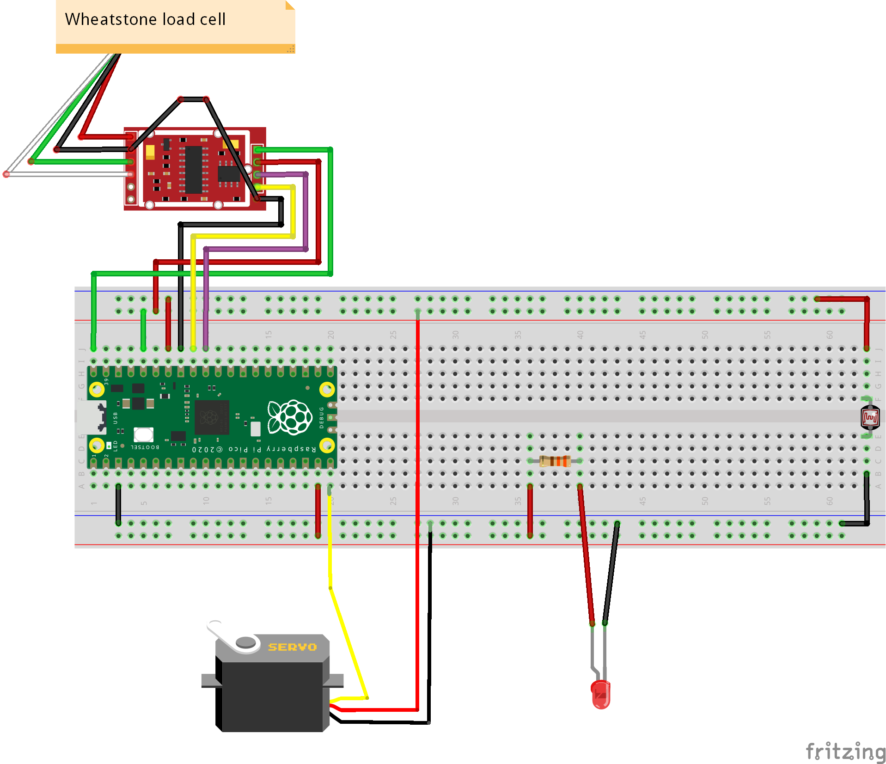 
The HX711 apparently has a known "error" with the grounding making the signals unstable and connecting the GND on both sides of the card can fix this.

### Build
- Cut out all the parts for the box (missing from the images are the piece for opening/servo and when the bottom/top parts of the scale where cut) 
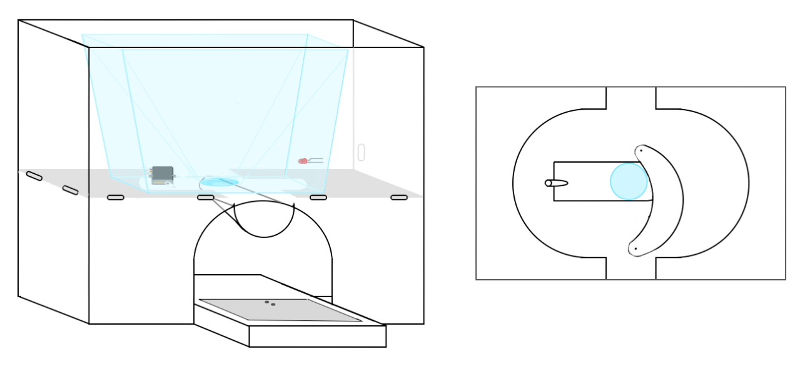  
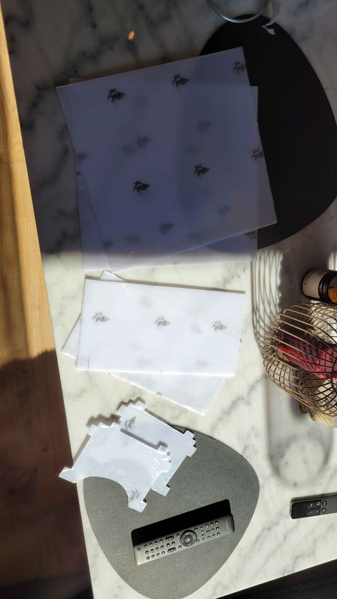 
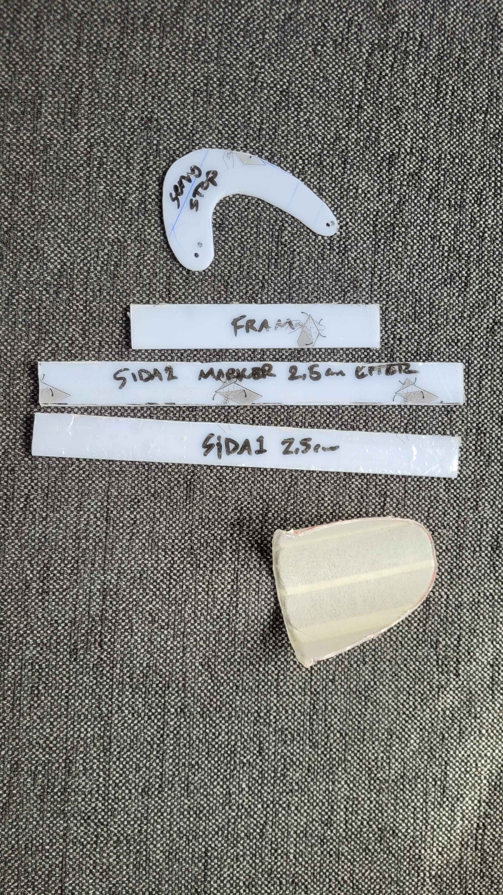 

- Assemble the outer box. 
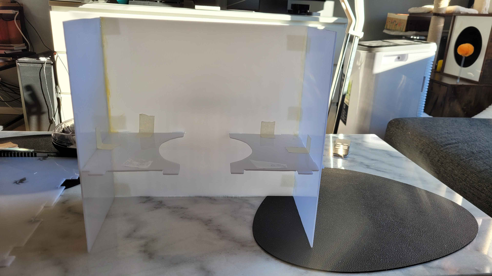 

- Alter the inner food container:
  - Cut a hole in the middle for the food to dispense.
  - Cut out two holes for the servo, one for the turning valve at the bottom and one at the side for the cable; Mount the servo.
  - Cut out a whole on the opposite side for the LED; Mount the LED.
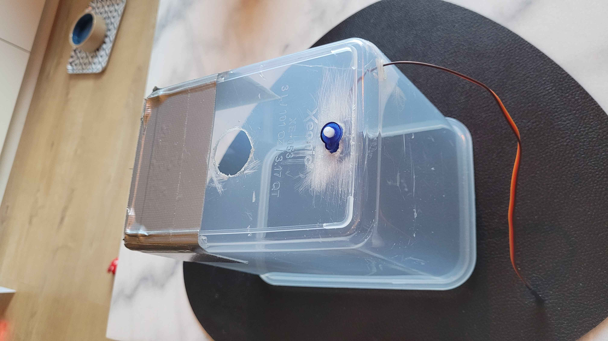 

- Build diagonal inner walls of the food container to protect the components and make the food fall easier into the hole.
- Mount the stop piece for the dispensing whole connected to the servo, also mount the vertical stop to prevent that piece from tipping down. 
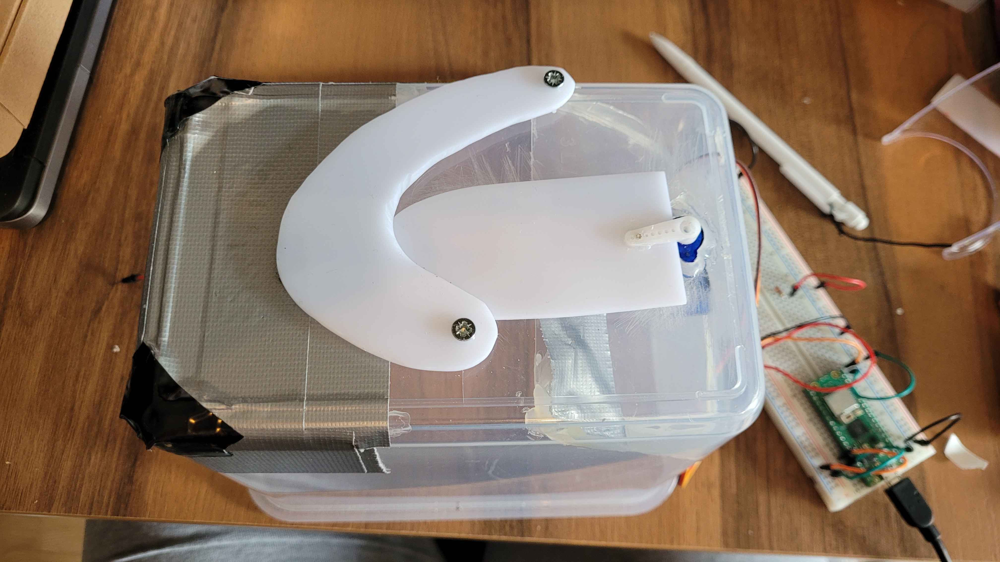 
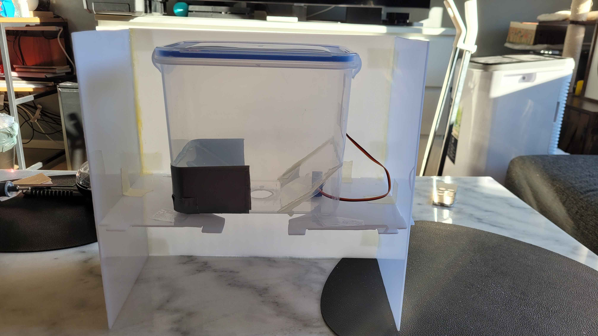 

- Mount the weightcell to the bottom board of the scale using bolts as spacers.
- Mount the scale top board to the weigthcell the same with bolts as spacers.  
**!! When mounting the weightcell be careful as to not put any pressure on the white sensor areas !!** 
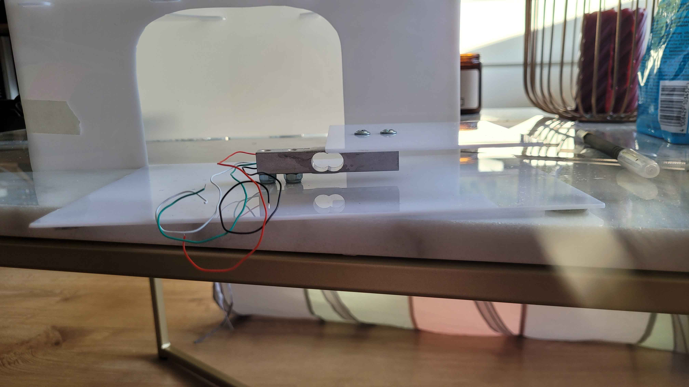 

- Connect the HX711 amplifier to the weightcell on one side, also connect cables that will run to the breadboard on the other side. (Look at the circuit diagram for the correct placement) 
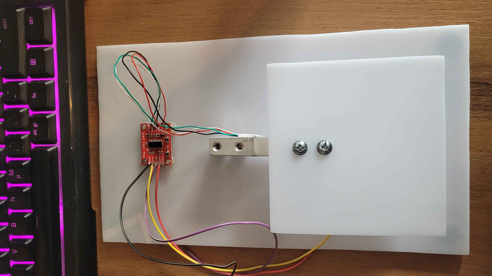 

- Finish building the scale walls. 
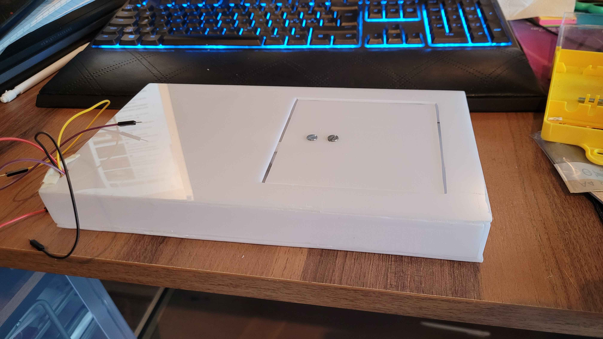 

- Connect the scale to the box construction by glueing it against the back wall and opening walls, use a cable channel on the back wall to protect the cables running from the scale to the top box.
- Cut out a hole in the outer plexiglas wall for the USB cable to run through.  
  **These two next steps can be made in either order, it can be easier to insert the breadboard before the food container**
- Insert the innerbox into the plexiglass box and fit the food chute to it's correct place, glue it in place (Mine is connected to the opening walls and the vertical servo stop.)
- Connect all the cables to the breadboard according to the circuit diagram and remove the sticker protection and stick it horizontally on the back inner wall. 
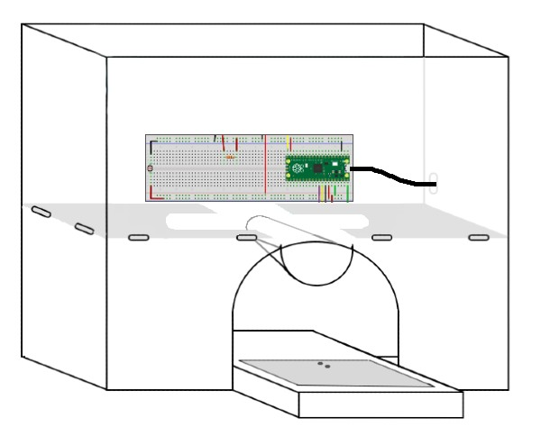 

- Now the box and hardware should be completed.  
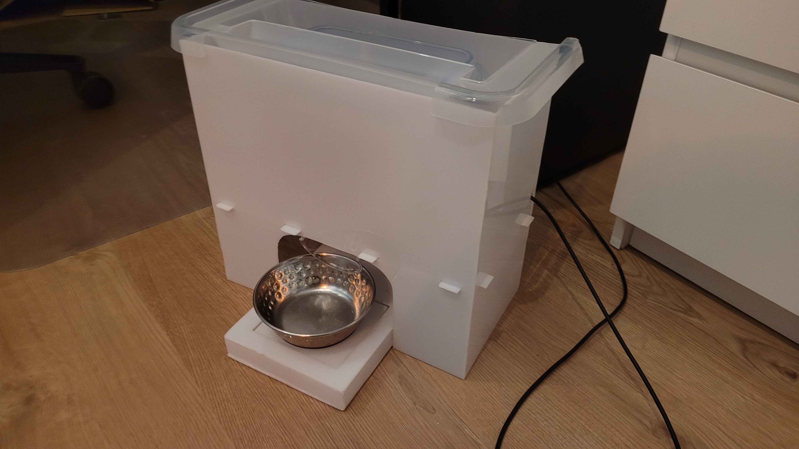 

## Platform
All code is run on the Raspberry Pi Pico W sending POST requests through the HTTP protocol, but only to visualize and send notifications, all control and checks for the acutators are all made locally on the device.

- AdaFruit IO: for data handling/visualization where the device will send the weight data using the request lib and the HTTP POST protocol via the built in WiFi module. Remember that all data saved on AdaFruit will expire within 30 days, there is a option for a paid version instead that (among other things) save the data for 60 days instead.
- Telegram API: used to send notification and messages to my cellphone/telegram app when the food runs low or the dispenser have trouble dispensing food.
  
### Set up a bot on Telegram:
- Install the telegram app on your computer [For PC/Linux](https://desktop.telegram.org/) [For macOS](https://macos.telegram.org/)
- Start a conversation with the [@BotFather](https://telegram.me/BotFather) by either clicking this link or searching in the telegram application for "@BotFather" (this is the telegram bot that creates other bots)
- Write "/start" to the BotFather, then select the "/newbot" option and follow the prompts that are given.
- At the end you will get a token to access the HTTP API, **SAVE THIS IN A SECURE PLACE**, this token will be used in the code to send messages (use an env file for "secret" variables that is included in a .gitignore file if the project is pushed to github or any other git platform)
- Create a new group chat in telegram, add the bot as a user in that chat and make the bot an admin user, send a random message in the chat.
- Take your bot token and insert this url into your browser where you insert your bot token from before (remove the {}): https://api.telegram.org/bot{YourBOTToken}/getUpdates
- In your browser you will see the API response as JSON, find this part and save your chat-id in a secure place: "chat": {**"id": -1234567**, "title": "titlename", "type": "chattype"}
- With the BOT Token and chat id you will now be able to send messages through your Raspberry Pi.

## The code
## Transmitting the Data / Connectivity
## Presenting the Data
## Finalizing the design
