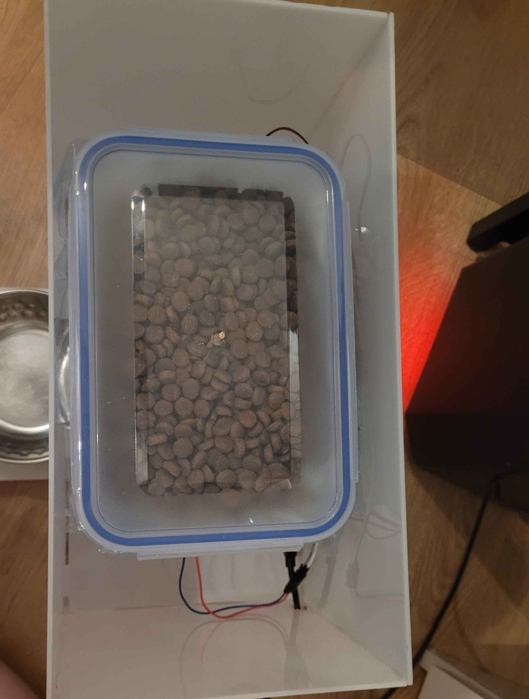

# Automatic Cat Feeder
**Author:** Jennifer von Trotta-Treyden (jv222th)

## Project overview
This project will create a prototype for an automatic cat feeder that dispenses food when the bowl is getting low (My cat is free fed meaning she always has kibble out). It would be simple to change it to instead dispense during certain times and fill the bowl to a certain weight instead of trying to keep the bowl consistently full aswell. The project uses an IoT device with both sensors and acutators, using the built in WiFi capabilities of the Raspberry Pi Pico W to send notifications through the Telegram API if there is an error in dispensing the food or if the container is running low, it also sends data to an AdaFruti IO server feed for data visualization. The build of the frame/casing consists of plexiglass, cut and built by hand, the innerbox and construction is made using a plastic container that has been altered to work for the project.

Estimated time to make the project could be anywhere between **6-24+** hours, a lot depends on how you choose to build the boxes/construction, the thing that took me the longest was to cut the plexiglass into pieces because of lack of proper tools for it and build the box and the second longest was debugging the HX711 and load cell setup.

**Code Language:** MicroPython

## Objective
I chose this project because I have an indoor cat and she is free fed (meaning she always has dry food out). I was contemplating different projects I could use surrounding my cat and knew I wanted to do something for her that would also make something easier for me, an auto feeder ended up being the most fitting project for that, that also both include sensors and acutators. It will make it easier to make sure that there is always food in the bowl both when you are away during the day but also if the food runs out in the middle of the night. It will also send notifications to my cellphone when the food is running low in the dispenser container so that I don't always have to check all the time if it needs refilling, the container has the capacity for approximately 4-5 full bowls which means I will not have to refill for around 4-5 days since my cat eats around a bowl a day.

I wanted to include both sensors and acutators to this project, since I was pretty new to IoT and the hardware aspect in general I wanted to challenge myself a bit on that front and learn more about it. I have a bit of knowledge about programming (mostly javascript/java though) so the hurdle there was just to get used to a new language (MicroPython).

## Material
Since I was pretty new with hardware I took a safe route and built everything on a breadboard, it made it easier to experiment and move the cables around but will in the end not be as securely attached as if it was soldered together instead. All of my material is bought from electrokit or my local store, but I will link the specific component in the table below.
There is one (1) of each component except the cables.

|  Component  | Description | Price (SEK) | Source/Artnr |
| --------  | ------- | ------- | ------- |
| Breadboard | The connecting board for all the components | **69** | [10160840](https://www.electrokit.com/kopplingsdack-840-anslutningar) |
| Raspberry Pi Pico WH | The microcontroller that runs the code and controls all the sensors and acutators, also sends data via a built in wifi capabilities | **109** | [41019114](https://www.electrokit.com/raspberry-pi-pico-wh) |
| USB to Micro USB cable | Powers the Raspberry pi pico and subsequent sensors/acutators | **39** | [41003290](https://www.electrokit.com/usb-kabel-a-hane-micro-b-5p-hane-1.8m) |
| Micro servo TS90 / SG90 360° 1.2kg | Controls the open and shut plate to dispense food | **64** | [41013137](https://www.electrokit.com/micro-servo-ts90-sg90-1.2kg-360) |
| HX711 amplifier | Acts as a middle point for the loadcell, converts the analog signals to digital and amplify it | **155** | [41013925](https://www.electrokit.com/forstarkare-for-lastceller-hx711) |
| Wheatstone load cell 1kg | The sensor that gauges weight, sends analog signals to the HX711 amplifier | **99** | [41016242](https://www.electrokit.com/lastcell-1kg) |
| Photoresistor | Sensor that measures the light, the brighter the light source the lower the resistance is and can hence tell the difference between light and dark | **9** | [40850001](https://www.electrokit.com/fotomotstand-cds-4-7-kohm) |
| 5mm LED lamp | Used to see if the inner containers need to be refilled | **5** | [40307020](https://www.electrokit.com/led-5mm-rod-diffus-1500mcd) |
| 330ohm 0.25W resistor | Lowers the resistance to the LED | **1** | [40810233](https://www.electrokit.com/motstand-kolfilm-0.25w-330ohm-330r) |
| Cables | Connect all the components | **55** | [41012684](https://www.electrokit.com/labbsladd-40-pin-30cm-hane/hane) |
| **Container build:** | --------------------------------------------------------------- | ------- | ------- |
| Food bowl | Will only be laying on the scale part, not attached to anything | **79,90** | [Arken zoo](https://www.arkenzoo.se/littlebigger-hamrad-metallic-skal-koppar) |
| Plexiglass | Used to built the box and scale | **199** | Local Jula store [LINK](https://www.jula.se/catalog/bygg-och-farg/beslag/inredningsbeslag/plastskivor/akrylplast-opal-024451/) |
| Plastic food container with lid | Used to contain the kibble and servo/LED | ?? | Sourced from home |
| Plastic container lid | Cut up to create the angled inner walls of the food container, protecting the servo and LED and make the food drop easier | ?? | Sourced from home |
| Plastic measuring bottle | Used to create the chute for the food to fall through | ?? | Sourced from home |
| Cable channel | Protects the cables running from the scale to the top box | ?? | Sourced from home |
| 4 screws and 4 bolts | Used to mount the loadcell to the bottom and top plates | ?? | Sourced from home |
| Glue | Both plastic/plexiglass contact glue and glue gun glue used to build the box | ?? | Sourced from home |
|  |  | Total: **883,9+** |  |

There is also different tools used:
- Glue gun
- Dremel
- Soldering iron and neccessary accessories for soldering (soldering lead, soldering water etc.).
- Sandpaper (For box edges)

## Computer Setup
### IDE
- Visual Studio Code (VSC) [link](https://code.visualstudio.com/Download)

### Extensions and extras
- [Node.js](https://nodejs.org/en) (required to make PyMakr work)
- PyMakr:
  - In VSC open the extensions tab on the left.
  - Write in "Pymakr" in the search bar.
  - Select the "Pymakr" by Pycom.
  - Click install.

- Create a new project in PyMakr:
  - Select the "PyMakr" tab on the left.
  - Create a new project by clickin the + sign on the **"PROJECTS"** tab.
  - Select where to save the project.
  - Write the name of the project folder.
  - Confirm the project folder.
  - Add device port by selecting **"Communications port (COM1) / Unkown"** <br><br>
    This should have created a folder in your **Explorer** tab where three files are automatically created, boot.py, main.py and pymakr.conf (In the pymakr.conf file you can decide the name of the project, that the name that will be shown in the PyMakr tab)

### Configure the Raspberry Pi Pico WH
  - Hold down the **BOOTSEL** button while connecting the Pico to the computer using the usb cable.
  - Download and insert the most recent firmware [HERE](https://micropython.org/download/RPI_PICO_W/) into the explorer file that automatically opens up.

## Putting everything together
### Circuit Diagram
This shows how all the hardware electronics are connected, the HX711 is soldered with all the cables and mounted on the scale part. The rest is connected with male/male cables and can be removed from the breadboard easily, some cables are also joined together to create a longer cable to reach from the mounted component to the breadboard, in that case I have used male/female cables and used electrical tape at the joint to make sure it doesn't slip out. <br><br>
<br>
The HX711 apparently has a known "error" with the grounding making the signals unstable and connecting the GND on both sides of the card can fix this.

### Build
- Cut out all the parts for the box (missing from the images are the piece for opening/servo and when the bottom/top parts of the scale where cut)<br>
<br><br>
<br>
<br>

- Assemble the outer box.<br>
<br>

- Alter the inner food container:
  - Cut a hole in the middle for the food to dispense.
  - Cut out two holes for the servo, one for the turning valve at the bottom and one at the side for the cable; Mount the servo.
  - Cut out a whole on the opposite side for the LED; Mount the LED.
<br>

- Build diagonal inner walls of the food container to protect the components and make the food fall easier into the hole.
- Mount the stop piece for the dispensing whole connected to the servo, also mount the vertical stop to prevent that piece from tipping down.<br>
<br>
<br>

- Mount the weightcell to the bottom board of the scale using bolts as spacers.
- Mount the scale top board to the weigthcell the same with bolts as spacers.<br><br>
**!! When mounting the weightcell be careful as to not put any pressure on the white sensor areas !!**<br>
<br>

- Connect the HX711 amplifier to the weightcell on one side, also connect cables that will run to the breadboard on the other side. (Look at the circuit diagram for the correct placement)<br>
<br>

- Finish building the scale walls.<br>
<br>

- Connect the scale to the box construction by glueing it against the back wall and opening walls, use a cable channel on the back wall to protect the cables running from the scale to the top box.
- Cut out a hole in the outer plexiglas wall for the USB cable to run through.<br><br>
  **These two next steps can be made in either order, it can be easier to insert the breadboard before the food container**
- Insert the innerbox into the plexiglass box and fit the food chute to it's correct place, glue it in place (Mine is connected to the opening walls and the vertical servo stop.)
- Connect all the cables to the breadboard according to the circuit diagram and remove the sticker protection and stick it horizontally on the back inner wall.<br>
<br>

- Now the box and hardware should be completed!.<br><br>

## Platform
All code is run on the Raspberry Pi Pico W sending POST requests through the HTTP protocol, but only to visualize and send notifications, all control and checks for the acutators are all made locally on the device.

- **AdaFruit IO:** for data handling/visualization where the device will send the weight data using the request lib and the HTTP POST protocol via the built in WiFi module. Remember that all data saved on AdaFruit will expire within 30 days, there is a option for a paid version instead that (among other things) save the data for 60 days instead.
- **Telegram API:** used to send notification and messages to my cellphone/telegram app when the food runs low or the dispenser have trouble dispensing food.
  
### Set up a bot on Telegram:
- Install the telegram app on your computer [For PC/Linux](https://desktop.telegram.org/) [For macOS](https://macos.telegram.org/)
- Start a conversation with the [@BotFather](https://telegram.me/BotFather) by either clicking this link or searching in the telegram application for "@BotFather" (this is the telegram bot that creates other bots)
- Write "/start" to the BotFather, then select the "/newbot" option and follow the prompts that are given.
- At the end you will get a token to access the HTTP API, **SAVE THIS IN A SECURE PLACE**, this token will be used in the code to send messages (use an env file for "secret" variables that is included in a .gitignore file if the project is pushed to github or any other git platform)
- Create a new group chat in telegram, add the bot as a user in that chat and make the bot an admin user, send a random message in the chat.
- Take your bot token and insert this url into your browser where you insert your bot token from before (remove the {}): https://api.telegram.org/bot{YourBOTToken}/getUpdates
- In your browser you will see the API response as JSON, find this part and save your chat-id in a secure place: "chat": {**"id": -1234567**, "title": "titlename", "type": "chattype"}
- With the BOT Token and chat id you will now be able to send messages through your Raspberry Pi.

## The code
All code is located in this repo and can be reached at the top.<br><br>
**TAKE NOTE!**<br>
The file that are not included in this repo is a ```.env``` file, this will contain all of your sensitive information, passwords, tokens etc. an example of that file is:
```
BOT_TOKEN=123456
CHAT_ID=-123456
SSID=WIFIROUTERUSERNAME
PSW=WIFIROUTERPASSWORD
ADAFRUIT_IO_KEY=aio_1234567
ADAFRUIT_API_FEED=AdaFruitusername/feeds/feedgroup.feedname/data
```

The first file to run when starting the device is:
```boot.py``` [TO CODE](./boot.py)

This will connect to your local wifi network and only run once at the beginning.
```
from networkSettings import connect_wifi
import os
from load_env import load_env, env_vars

load_env()

# Network credentials.
SSID = env_vars.get('SSID')
PASSWORD = env_vars.get('PSW')

## Connect to the WiFi network.
connect_wifi(SSID, PASSWORD)
```
<br>

After the ```boot.py``` file is done running it will immediately run the ```main.py``` [TO CODE](./main.py), this will run indefinitely until the device is turned off.

```
from networkSettings import sendTelegramMessage, sendAdafruitData
from servo import ServoClass
from photoSensor import LightSensor
from weightCell import WeightCell
from utime import sleep, time # type: ignore

# Initialize all the classes.
light = LightSensor()
weight = WeightCell()
servo = ServoClass()

# Initialize a variable to track the last time a reminder was sent to the user using Telegram.
lastMessageTime = 0  # Initial value, representing epoch time.

# Define constants.
LOW_LIGHT_THRESHOLD = 51000  # Adjust this threshold as needed.
REFILL_WEIGHT_THRESHOLD = 85  # Adjust this threshold as needed.
HOURS_TO_WAIT = 6 * 3600  # 3600 is seconds per hour so change the first number for the amount of hours.
LOOP_TIME = 10 * 60 # 60 seconds per minute, change the first number to decide the amount of minutes.


while True:
    lightMeasurement = light.measureLight()
    weightMeasurement = weight.getCurrentWeight()
    sendAdafruitData(weightMeasurement - 73)

    # --------> Check if light is low and it's time to send a message <--------
    if lightMeasurement < LOW_LIGHT_THRESHOLD:
        currentTime = time()

        # Check if enough time has passed since the last message was sent and if a new one should be sent or not.
        if currentTime - lastMessageTime >= HOURS_TO_WAIT:
            sendTelegramMessage("Food is running low! Please refill!")
            lastMessageTime = currentTime  # Update the last message time to delay next time it sends a message (don't spam reminders to often!)

    # --------> Check if weight is low and trigger servo action <--------
    if weightMeasurement <= REFILL_WEIGHT_THRESHOLD:
        tries = 0
        refill_success = False

        while weightMeasurement <= 150:
            servo.turnValve() # Try turning the valve to fill the bowl.
            sleep(10)
            weightMeasurement = weight.getCurrentWeight() # Check how much was dispensed.
            tries += 1

            if weightMeasurement > 150:
                refill_success = True
                break

            # Try 15 times to fill the bowl before alerting that something went wrong.
            if tries == 15:
                sendTelegramMessage("Something went wrong, can't refill bowl!")
                break

            sleep(20) # Try every 20 seconds to fill until the desired weight is reached.

        if not refill_success:
            print("Refill failed after 15 tries.")

    sleep(LOOP_TIME) # Loop the entire check every X seconds. <-----------------
```

### The code files in this repo that are used in both boot.py and main.py:
- [hx711](./hx711.py)
- [networkSettings](./networkSettings.py)
- [load_env.py](./load_env.py)
- [photoSensor](./photoSensor.py)
- [servo](./servo.py)
- [weightCell](./weightCell.py)

To upload the code onto the device you can use **PyMakr** to connect to the device and click **"sync project to device"** (Starting development mode will work aswell and updates the device continously while you change and save the code)

### Calibrate the weightcell:
In your **PyMakr** tab you can open a terminal for your project in the connected device tab of the project.

You have to calibrate your weightcell, comment the entire **while** loop in the main.py file by inserting ``` before and after the loop. Insert this loop at the bottom outside of the **while** loop:

```
while True:
    print(weight.getCurrentWeight())
    sleep(1)
```

In the ```weightCell.py``` [file](./weightCell.py), this is the method you need to change, replace the ```trunc(val)``` part with ```raw_value``` for the calibration process:
```
    def getCurrentWeight(self):
        try:
            raw_value = self.hx.get_value()
            tare_offset = -66500
            known_weight_73g = -155300
            
            scale_factor = (known_weight_73g - tare_offset) / 73

            # Calculate the weight based on calibration
            val = (raw_value - tare_offset) / scale_factor

        except KeyboardInterrupt:
            print("Interrupted")

        except Exception as e:
            print("Exception during measurement:", e)

        return trunc(val)
```

Make note of the value you get with no pressure on the loadcell, wait a little bit and try to get an average of a couple of values when it feels like it is somewhat "stable".
Replace your average in the tare_offset: <br>
```tare_offset = -66500```<br><br>

Now you need to weigh a known weight (I have chosen my bowl that weighs 73g), do the same thing as before but with the known weight on the pressure plate and replace your number in the ```known_weight_73g = -155300```, also replace the last number in this ```scale_factor = (known_weight_73g - tare_offset) / 73``` with your known weight.<br>

When you are done with these calibrations you will have to reset the rest of the code, make sure ```return trunc(val)``` is at the end of the getCurrentWeight() method and remove or comment the new while loop in the ```main.py``` file, de-comment the original while True loop and save/sync project with device.

## Transmitting the Data / Connectivity
I first wanted to try the LoRaWan setup for sending data wirelessly (I even bought the pack for it) but because I felt time was running out and I had to put a lot of time into debugging the weightcell and building the box, and since my device will always be located inside my home, close to a wifi point, it was easier and quicker to use the built in WiFi module in the Raspberry Pi Pico W.

All the code for transmitting data and connectivity is located in the [networkSettings.py](./networkSettings.py) and data is transmitted every 10 minutes to the AdaFruit IO server<br><br>
The data is transmitted using the HTTP protocol (using POST) and the built in microPython request library, this is the connection configurations in the code:
```
def connect_wifi(ssid, password):
    wlan = network.WLAN(network.STA_IF)
    wlan.active(True)
    wlan.connect(ssid, password)
    
    while not wlan.isconnected():
        time.sleep(1)
    print('Connected to WiFi')
    print(wlan.ifconfig())
```
The method is called in the ```boot.py``` file when the device is being connected.

It also sends POST requests using the HTTP protocol for transmitting data to both AdaFruit IO and the Telegram API:
```
# Send a message through the telegram app.
def sendTelegramMessage(message):
    url = 'https://api.telegram.org/bot{}/sendMessage'.format(env_vars.get('BOT_TOKEN'))
    payload = {"chat_id": env_vars.get('CHAT_ID'), "text": message}
    
    response = requests.post(url, json=payload)
    print(response.json())

# Send data to Adafruit IO
def sendAdafruitData(data):
    url = f"https://io.adafruit.com/api/v2/{ADAFRUIT_API_FEED}"
    headers = {
        "X-AIO-Key": ADAFRUIT_IO_KEY,
        "Content-Type": "application/json"
    }
    body = {
        "value": str(data)
    }

    try:
        response = requests.post(url, json=body, headers=headers)
        print(response.text)
        
        if response.status_code == 200:
            print("Successfully sent data:", body)
        else:
            print ("Failed to send data to Adafruit", body)

    except Exception as e:
        print("An error occurred while sending data:", e)

```

## Presenting the Data
The data will be collected using the AdaFruit IO cloud server and stored for 30 days, it will show the food being consumed based on weight and time. When entering the feed in the adaFruit account it will show a graph showing the data, you can also decide to show a specified time frame or remove any data that is an anomaly (if the weightcell gives of an unstable value for instance, sometimes it can for example drop below 0).<br>
<br>

It will show warnings to me when the food is running low in the container or the servo can't fill the bowl for some reason, it will try 15 times before it will message me, all of these messages/warnings will be sent through the Telegram app:<br>
<br>

## Finalizing the design
It was a fun project to take on, it went pretty smoothly. The only things that took much longer than expected was building the actual box, I used a dremel to cut all the pieces and had to use mouth/eye protection since it was very dusty and it took a long time, configuring and installing the weightcell also took a lot of back and forth and of course figuring out the set up design took a long time. <br><br>

If I could have done something different it would have been to use an external power supply that I could hook up directly to the HX711 instead of trying to power it through the board, because I think it would work better if it could receive a stable 5V charge, as it is now it is giving pretty unstable values and the calibrating took me forever, I can get it to give an accuracy around +/- 5-10g measurements. The same could be said about the servo, it would probably work better with a higher voltage and I should have used a stronger servo, it can get stuck since it doesn't have the power to push through sometimes, and the food can get stuck in the container aswell sometimes (hence why I configured a warning message being sent through telegram) and with a stronger servo I could have had attached some form of stick that pokes inside the container when it opens and closes to "mix it" a little bit, alternatively had a second servo with some form of stick rotating inside the food to help it not get "stuck".

In the future it would also be better to remove the breadboard and solder all the wiring to a proper board to make them more stable and create a proper container within the box for it. I would also want to create a proper lid to the box, I ran out of plexiglass and couldn't justify putting 2-300SEK more into the project for a small piece of plexiglass (since they are sold in pre-cut sizes)
<br>
<br><br>

I was also lucky to have a lot of support from my partner that could help me when I had questions about hardware, he taught me how to solder for instance, since before this project I had never done that before.
